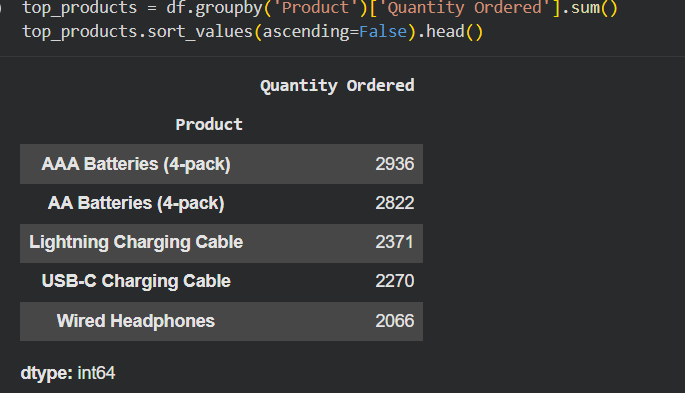
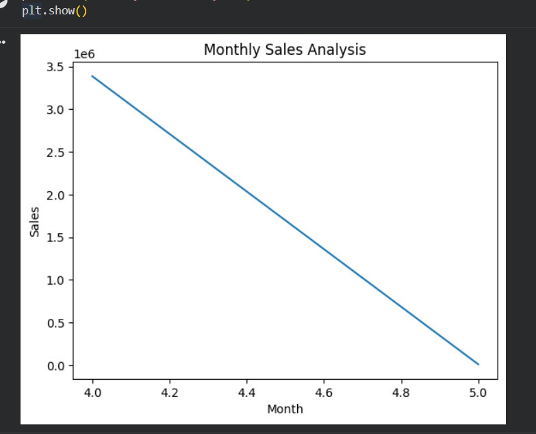

# Sales-Data-Analysis
Sales data analysis using Python to identify monthly trends and top-selling products.
- Analyzed sales dataset using Python  
- Identified monthly sales trends  
- Found top-selling products  
- Created visualizations using Matplotlib  

## Key Insights
- Sales vary across months  
- Certain products have higher demand  

## Tools Used
- Python  
- Pandas  
- Matplotlib
## Screenshots

